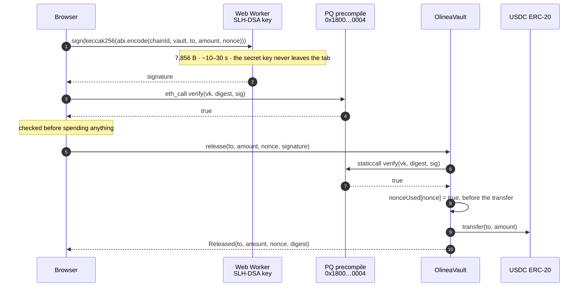

<p align="center">
  <picture>
    <source media="(prefers-color-scheme: dark)" srcset="assets/logo-mark.png">
    
  </picture>
</p>

<h1 align="center">Olinea</h1>

<p align="center">
  <a href="#deployment"></a>
  <a href="#the-primitive"></a>
  <a href="#verify-it-yourself"></a>
  <a href="#security"></a>
  <a href="LICENSE"></a>
</p>

<p align="center">Post-quantum USDC vault on Arc mainnet · SLH-DSA-SHA2-128s · no owner, no admin, no pause, no upgrade path</p>

**USDC a quantum computer can't move.**

A USDC vault on Arc that releases funds only when a post-quantum signature — **SLH-DSA-SHA2-128s**
(FIPS 205) — verifies on-chain through Arc's PQ precompile. The vault has no privileged role at all,
including for the people who wrote it.

## The problem

Every USDC account on every chain today is guarded by an elliptic-curve key. A quantum computer running
Shor's algorithm breaks that, retroactively for recorded signatures. By the time that is a practical
threat against an active key, the signatures will already be sitting in many chains' historical record.

There are two honest answers to that:

- **don't hold long-lived USDC in an ECDSA account**, or
- **hold it in a vault whose release a quantum computer still cannot forge**.

Olinea is the second answer on Arc mainnet. The vault releases USDC only when an SLH-DSA-SHA2-128s
signature verifies through Arc's PQ precompile. ECDSA can be broken; hash-based signatures from this
class are not broken by breaking ECDSA.

This is not a claim about a future, hypothetical property. It is a claim about the release path the vault
actually uses today: a 32-byte verifying key fixed at deployment, a digest that binds chain id, vault,
recipient, amount and nonce, and an on-chain check against Arc's PQ precompile before anything moves.

## Deployment

| Thing | Value |
|---|---|
| Factory | `0x09574E49690ad378b21D2cb42a529f71A0D1DAdB` |
| Factory deploy tx | `0x6a801dfb7213b78a45b4eccd39ba324f18e68e2d2ac1ba677a35cf9662faf405` |
| Chain | Arc mainnet · 5042 |
| **Vault created from the console's 24 words** | `0xA36f07eEB907C0eBc09ecb79802f5037a0382A22` |
| Its createVault tx | `0xdc170513882823758fc047d41e58d241a5fa8c7491446587ce34ee2d2210f0ab` |
| Its deposit tx (0.20 USDC) | `0x1b13b14016ae6232dffcb5e86229f2ac230b1fa82a85d1e8a10ea39bef2aa92e` |
| Its release tx (0.10 USDC, nonce 0) | `0x4f637edd2c27f0b2988e0c2cf62f833b215623a23cd624c7e7fa9b63e8320c43` |
| Signed digest (browser) | `0x8b63f119dfb0f6bc490629d59e957e73cb4f7993a1d5b4966d949f8b9df9a2c2` |
| Earlier vault (key from `pq.mjs` keygen) | `0x88fCbF5896902527C175A9114584d5E92Cac8eB9` |
| Its createVault tx | `0x21aa83cede65ebcc31564225e471f52821579422b82b8d2d59edd5ab4d124605` |
| Its deposit tx (0.10 USDC) | `0x5ef9a9b9453f11a161e1ce725b1dfa5ceca5ee2acf347a20788555d25846090d` |
| Its release tx (0.05 USDC) | `0x983129eeed46931305393eb831042244b23fa8f50aa89acc0889db9daf3ed5ed` |
| Console | `olinea.sithunyein.com/app/?vault=0xA36f07eEB907C0eBc09ecb79802f5037a0382A22` |

Every one of those is on `explorer.arc.io`. A reviewer can open the console link above with no wallet,
no key and no gas, and read the vault's address, balance and both events off Arc mainnet. That vault is
the one whose key was made from 24 words generated in a browser tab — the same path any visitor takes
when they create a key and a vault for themselves. Its release was signed there in 21.0 s, the page
recomputed the digest and showed it identical to the vault's own `authorizationDigest`, and Arc's
precompile accepted the signature in 404 ms before anything was broadcast. nonce 0 is spent, 0.10 USDC
is still held, and the browser's backup is the only key that can move it.

The second vault followed the same path with a key from `scripts/pq.mjs keygen` instead of a browser
phrase: 0.10 USDC deposited, 0.05 released, 0.05 still held.

## Table of contents

- [The problem](#the-problem)
- [Deployment](#deployment)
- [How a release works](#how-a-release-works)
- [The primitive](#the-primitive)
- [The footgun](#the-footgun)
- [Verify it yourself](#verify-it-yourself)
- [Project structure](#project-structure)
- [Security](#security)
- [Roadmap](#roadmap)
- [Contributing](#contributing)
- [License](#license)

## How a release works



The relayer never needs the key, and the key never needs an Arc account. Anyone can pay the gas for
someone else's release and gain nothing by it.

## The primitive

| Thing | Value |
|---|---|
| Precompile | `0x1800000000000000000000000000000000000004` |
| Selector | `0xbf4db8ba` — `verifySlhDsaSha2128s(bytes,bytes,bytes)` |
| Arguments | `(verifyingKey 32 B, message any length, signature 7856 B)` |
| Returns | `bool` — an invalid signature returns `false`, **it does not revert** |
| Gas | 382,879 ≈ $0.0077 per verification — about 1,300× a plain USDC transfer |

Verified on Arc mainnet with real keypairs: a valid signature returns `true`; a one-bit tampered
signature, the same signature checked against a different public key, and a valid signature over a
different digest all return `false`. Arc's execution layer is public in `circlefin/arc-node`
(`crates/pq-precompile`), so the ABI is not a secret — the work is in executing it correctly and saying
honestly what it does and does not buy you.

## The footgun

```solidity
// WRONG — accepts every forged signature, because a bad signature is a value, not an exception
(bool ok, ) = PRECOMPILE.staticcall(data);
require(ok, "verify failed");

// CORRECT
(bool ok, bytes memory ret) = PRECOMPILE.staticcall(data);
require(ok && abi.decode(ret, (bool)), "invalid PQ signature");
```

`contracts/src/mocks/NaiveVault.sol` is this mistake, written out on purpose and kept in the tree with a
test that lets the attacker walk away with the balance. Do not copy it.

## Verify it yourself

No API key, no wallet, no Arc account, and no dependency on this project being honest: every command
below reads public state or runs locally.

```bash
git clone --recurse-submodules https://github.com/thesithunyein/olinea
cd olinea

# 1. the contracts
cd contracts && forge test                       # 31 tests, 0 failed

# 2. a real signature, verified by Arc's real precompile on mainnet
cd ../scripts && npm install
node pq.mjs conformance                          # valid → true; tampered signature and a different digest → false

# 3. the site and console still agree with the contracts
cd .. && node scripts/check-site.mjs             # no network, no dependencies

# 4. the committed crypto still derives the key the live vault is holding
#    (reads LOCAL/browser-vault.txt if you have it — the words are never printed)
cd scripts/vendor && npm install && cd ../..
node scripts/vendor/parity.mjs                   # bundle vs the packages it was built from, and vs chain
```

Point the last one at the deployed factory and it checks the deployed claims too:
`CONFIG_factory=0x09574E49690ad378b21D2cb42a529f71A0D1DAdB node scripts/check-site.mjs`.

## Project structure

```
olinea/
├── index.html                  the landing page                        → /
├── submit.html                 the console pinned to the deployed factory
├── docs/
│   ├── index.html              the documentation                       → /docs/
│   ├── architecture.svg        the diagram above, drawn on a dark ground
│   └── architecture-light.svg  the same diagram, drawn on white
├── app/
│   ├── index.html              the vault console                       → /app/
│   ├── worker.js               keygen and signing, off the main thread
│   └── vendor/                 viem and the noble primitives, bundled — nothing loads at runtime
├── contracts/                  Foundry project
│   ├── src/
│   │   ├── OlineaVault.sol     the vault: no owner, no admin, no upgrade path
│   │   ├── OlineaFactory.sol   createVault(bytes verifyingKey) in one transaction
│   │   ├── interfaces/         IPQ.sol · IUSDC.sol — the ABIs, kept minimal
│   │   └── mocks/              MockUSDC · MockPQ · NaiveVault (deliberately broken)
│   ├── test/                   OlineaVault.t.sol (19) · OlineaFactory.t.sol (12)
│   ├── lib/forge-std           a submodule — clone with --recurse-submodules
│   ├── README.md               the two load-bearing details and the mainnet runbook
│   └── foundry.toml            arc / arc_blockdaemon RPC endpoints · fmt rules
├── assets/
│   ├── fonts/                  Poppins: 18 committed faces and the one stylesheet that names them
│   ├── three/                  three.js and the single addon the hero imports
│   ├── favicon.png             the mark, cut to the size a browser tab asks for
│   └── logo-mark*.png          one artwork, cut for dark, light and ink grounds
├── scripts/
│   ├── pq.mjs                  keygen · authorize · conformance — no wallet, no gas
│   ├── check-site.mjs          structural checks: docs and console vs the contracts
│   └── vendor/                 how the committed copies were made — build.mjs · fonts.mjs ·
│                               parity.mjs · serve.mjs, the local server used to verify them
├── .github/                    CI (contracts + site), issue forms, PR template
├── vercel.json                 the security headers, including the CSP below
├── .vercelignore               the deploy publishes web pages and nothing else
├── .editorconfig
├── SECURITY.md                 threat model: what this protects you from, and what it does not
├── CONTRIBUTING.md             setup, and the two rules that must not be broken
├── CHANGELOG.md                Keep a Changelog
├── CODE_OF_CONDUCT.md
└── LICENSE                     MIT
```

There is no build step, but there is no CDN either: the pages are hand-written HTML, and every module,
font and geometry they load is committed beside them — the console's crypto under `app/vendor/`
(bundled by `scripts/vendor/build.mjs`, versions pinned to the ones the key derivation was measured
against), three.js under `assets/three/`, the typeface under `assets/fonts/`. So what is deployed is
what is in the repository, the live site can be diffed against a commit byte for byte, and a cold load
names no host but this one — a page is only as available as its slowest third party. `LOCAL/` and
dependency folders are gitignored; everything a page loads at runtime is committed.

## Security

Read [**SECURITY.md**](SECURITY.md) before trusting this with money. The short version:

- **What it guarantees.** No privileged role exists; the verifying key is a constructor argument and is
  never reassigned; a release needs a signature over a digest binding the chain, the vault, the
  recipient, the amount and a nonce; the nonce is consumed before the transfer; and the precompile's
  boolean is decoded, so a forged signature is a rejection rather than a successful call.
- **What it does not.** USDC on Arc still honours Circle's denylist — the largest caveat in the project.
  A compromised browser defeats everything below it. Only the *release* path is post-quantum; a deposit
  is an ordinary ERC-20 transfer authorised by an ECDSA account. Lose the 24 words and the USDC is
  unspendable by anyone, permanently. This is unaudited.
- **Reporting.** Anything that could move funds without a valid signature goes to
  **sithunyein.mailto@gmail.com**, not the issue tracker. There is no bug bounty — this is an unfunded
  project and there is no pot to pay from.

## Roadmap

Ordered by how much it would change an honest reader's mind, not by how impressive it sounds.

1. **M-of-N release.** k-of-n SLH-DSA signatures over the same digest, reusing the same precompile.
   The digest already binds the whole intent, so the contract change is small and the story is not:
   a vault that no single compromised machine can open.
2. **Make the console's limits visible in the console.** A per-transaction cap and an allowlist enforced
   on-chain, so a stolen key has a bounded loss rather than an unbounded one.
3. **Borrowing, when it is real.** Arc mainnet has 14 live Morpho markets reachable through Circle's
   Borrow Kit with no credential, and a total of **0.274 USDC** of borrowable liquidity across all of
   them. A borrow feature built today is a UI for a market where nobody can borrow. Revisit when that
   number is worth a user's time; the interesting composition is a borrowing position whose authority
   is post-quantum, which is a genuine gap in the sample Circle shipped.

## Contributing

See [CONTRIBUTING.md](CONTRIBUTING.md). The two rules that are not up for debate: **never change the
key derivation without a version bump** (every backup depends on those bytes), and **never add a
privileged role**. Participation is covered by the [Code of Conduct](CODE_OF_CONDUCT.md).

## License

MIT © 2026 Sithu Nyein. See [LICENSE](LICENSE).
