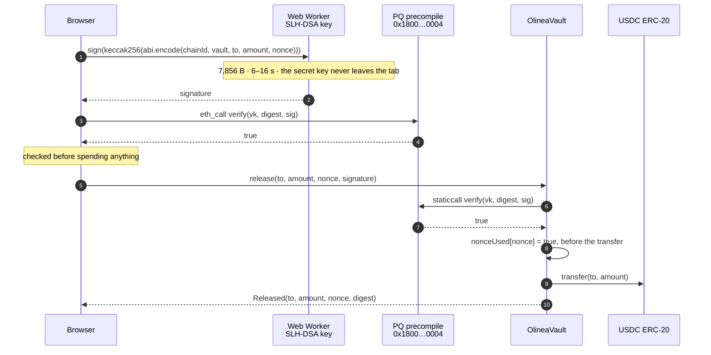

<div style="display:flex;flex-direction:column;align-items:center;gap:14px;margin-bottom:6px">
  
  <div>
    <h1 style="margin:0;font-size:clamp(22px,3vw,30px);letter-spacing:-.02em">Olinea</h1>
    <p style="margin:4px 0 0;color:#868e96">Post-quantum USDC vault on Arc mainnet · SLH-DSA-SHA2-128s · no owner, no admin, no pause, no upgrade path</p>
  </div>
</div>

**USDC a quantum computer can't move.**

A USDC vault on Arc that releases funds only when a post-quantum signature — **SLH-DSA-SHA2-128s**
(FIPS 205) — verifies on-chain through Arc's PQ precompile. The vault has no privileged role at all, 
including for the people who wrote it.

[](LICENSE)
[](#verify-it-yourself)
[](#the-primitive)
[](#the-primitive)
[](#security)
[](#deployment)## The problem

Every USDC account on every chain today is guarded by an elliptic-curve key. A quantum computer running
Shor's algorithm breaks that, retroactively for recorded signatures. By the time that is a practical 
threat against an active key, the signatures will already be sitting in many chains' historical record.

There are two honest answers to that: 

- **don't hold long-lived USDC in an ECDSA account**, or 
- **hold it in a vault whose release a quantum computer still cannot forge**.

Olinea is the second answer on Arc mainnet. The vault releases USDC only when an SLH-DSA-SHA2-128s 
signature verifies through Arc's PQ precompile. ECDSA can be broken; hash-based signatures from this 
class are not broken by breaking ECDSA.

This is not a claim about a future, hypothetical property. It is a claim about the release path the vault 
actually uses today: a 32-byte verifying key fixed at deployment, a digest that binds chain id, vault, 
recipient, amount and nonce, and an on-chain check against Arc's PQ precompile before anything moves.


## Status

- [x] The factory is deployed on Arc mainnet: `0x09574E49690ad378b21D2cb42a529f71A0D1DAdB`, deployed by `0x6a801dfb7213b78a45b4eccd39ba324f18e68e2d2ac1ba677a35cf9662faf405`.
- [x] The live console opens against it: `olinea.sithunyein.com/app/?factory=0x09574E49690ad378b21D2cb42a529f71A0D1DAdB`.
- [ ] A vault created through the deployed factory and used end to end in the console. The console's vault path (create → deposit → authorize → release) is wired to the deployed factory, and a funded vault on the deployed factory is the remaining demo.
- [ ] A third-party audit. There has not been one.

## Deployment

| Thing | Value |
|---|---|
| Factory | `0x09574E49690ad378b21D2cb42a529f71A0D1DAdB` |
| Deploy tx | `0x6a801dfb7213b78a45b4eccd39ba324f18e68e2d2ac1ba677a35cf9662faf405` |
| Chain | Arc mainnet · 5042 |
| Console | `olinea.sithunyein.com/app/?factory=0x09574E49690ad378b21D2cb42a529f71A0D1DAdB` |

## Table of contents

- [The problem](#the-problem)
- [How a release works](#how-a-release-works)
- [The primitive](#the-primitive)
- [The footgun](#the-footgun)
- [Verify it yourself](#verify-it-yourself)
- [Project structure](#project-structure)
- [Security](#security)
- [Roadmap](#roadmap)
- [Contributing](#contributing)
- [License](#license)

## How a release works




The relayer never needs the key, and the key never needs an Arc account. Anyone can pay the gas for
someone else's release and gain nothing by it.

## The primitive

| Thing | Value |
|---|---|
| Precompile | `0x1800000000000000000000000000000000000004` |
| Selector | `0xbf4db8ba` — `verifySlhDsaSha2128s(bytes,bytes,bytes)` |
| Arguments | `(verifyingKey 32 B, message any length, signature 7856 B)` |
| Returns | `bool` — an invalid signature returns `false`, **it does not revert** |
| Gas | 382,879 ≈ $0.0077 per verification — about 1,300× a plain USDC transfer |

Verified on Arc mainnet with a real keypair: a valid signature returns `true`; a one-bit tampered
signature, a wrong public key, and a mismatched message all return `false`. Arc's execution layer is
public in `circlefin/arc-node` (`crates/pq-precompile`), so the ABI is not a secret — the work is in
executing it correctly and saying honestly what it does and does not buy you.

## The footgun

```solidity
// WRONG — accepts every forged signature, because a bad signature is a value, not an exception
(bool ok, ) = PRECOMPILE.staticcall(data);
require(ok, "verify failed");

// CORRECT
(bool ok, bytes memory ret) = PRECOMPILE.staticcall(data);
require(ok && abi.decode(ret, (bool)), "invalid PQ signature");
```

`contracts/src/mocks/NaiveVault.sol` is this mistake, written out on purpose and kept in the tree with a
test that lets the attacker walk away with the balance. Do not copy it.

## Project structure

```
olinea/
├── index.html                  the landing page                        → /
├── docs/
│   ├── index.html              the documentation                       → /docs/
│   └── architecture.svg        the diagram above, and in the docs
├── app/
│   ├── index.html              the vault console                       → /app/
│   └── worker.js               keygen and signing, off the main thread
├── contracts/                  Foundry project
│   ├── src/
│   │   ├── OlineaVault.sol     the vault: no owner, no admin, no upgrade path
│   │   ├── OlineaFactory.sol   createVault(bytes verifyingKey) in one transaction
│   │   ├── interfaces/         IPQ.sol · IUSDC.sol — the ABIs, kept minimal
│   │   └── mocks/              MockUSDC · MockPQ · NaiveVault (deliberately broken)
│   ├── test/                   OlineaVault.t.sol (17) · OlineaFactory.t.sol (10)
│   ├── lib/forge-std           a submodule — clone with --recurse-submodules
│   ├── README.md               the two load-bearing details and the mainnet runbook
│   └── foundry.toml            arc / arc_blockdaemon RPC endpoints · fmt rules
├── scripts/
│   ├── pq.mjs                  keygen · authorize · conformance — no wallet, no gas
│   └── check-site.mjs          structural checks: docs and console vs the contracts
├── .github/                    CI (contracts + site), issue forms, PR template
├── .vercelignore               the deploy publishes web pages and nothing else
├── .editorconfig
├── SECURITY.md                 threat model: what this protects you from, and what it does not
├── CONTRIBUTING.md             setup, and the two rules that must not be broken
├── CHANGELOG.md                Keep a Changelog
├── CODE_OF_CONDUCT.md
└── LICENSE                     MIT
```

There is no build step and no bundler. The pages are hand-written HTML with ES modules imported from a
CDN at pinned versions, so what is deployed is what is in the repository — the live site can be diffed
against a commit, byte for byte. `LOCAL/` and build output are gitignored; nothing else is.

## Security

Read [**SECURITY.md**](SECURITY.md) before trusting this with money. The short version:

- **What it guarantees.** No privileged role exists; the verifying key is a constructor argument and is
  never reassigned; a release needs a signature over a digest binding the chain, the vault, the
  recipient, the amount and a nonce; the nonce is consumed before the transfer; and the precompile's
  boolean is decoded, so a forged signature is a rejection rather than a successful call.
- **What it does not.** USDC on Arc still honours Circle's denylist — the largest caveat in the project.
  A compromised browser defeats everything below it. Only the *release* path is post-quantum; a deposit
  is an ordinary ERC-20 transfer authorised by an ECDSA account. Lose the 24 words and the USDC is
  unspendable by anyone, permanently. This is unaudited.
- **Reporting.** Anything that could move funds without a valid signature goes to
  **sithunyein.mailto@gmail.com**, not the issue tracker. There is no bug bounty — this is an unfunded
  project and there is no pot to pay from.

## Roadmap

Ordered by how much it would change an honest reader's mind, not by how impressive it sounds.

1. **A funded vault end to end in the console.** About two cents of gas converts the last untested seam
   in this repository — "the vault runs on a local chain, the precompile was proven on mainnet" — into a
   single tested path: create a vault through the deployed factory, deposit USDC, authorize a release,
   and release it, all from the live console.
2. **M-of-N release.** k-of-n SLH-DSA signatures over the same digest, reusing the same precompile.
   The digest already binds the whole intent, so the contract change is small and the story is not:
   a vault that no single compromised machine can open.
3. **Make the console's limits visible in the console.** A per-transaction cap and an allowlist enforced
   on-chain, so a stolen key has a bounded loss rather than an unbounded one.
4. **Borrowing, when it is real.** Arc mainnet has 14 live Morpho markets reachable through Circle's
   Borrow Kit with no credential, and a total of **0.274 USDC** of borrowable liquidity across all of
   them. A borrow feature built today is a UI for a market where nobody can borrow. Revisit when that
   number is worth a user's time; the interesting composition is a borrowing position whose authority
   is post-quantum, which is a genuine gap in the sample Circle shipped.

## Contributing

See [CONTRIBUTING.md](CONTRIBUTING.md). The two rules that are not up for debate: **never change the
key derivation without a version bump** (every backup depends on those bytes), and **never add a
privileged role**. Participation is covered by the [Code of Conduct](CODE_OF_CONDUCT.md).

## License

MIT © 2026 Sithu Nyein. See [LICENSE](LICENSE).
